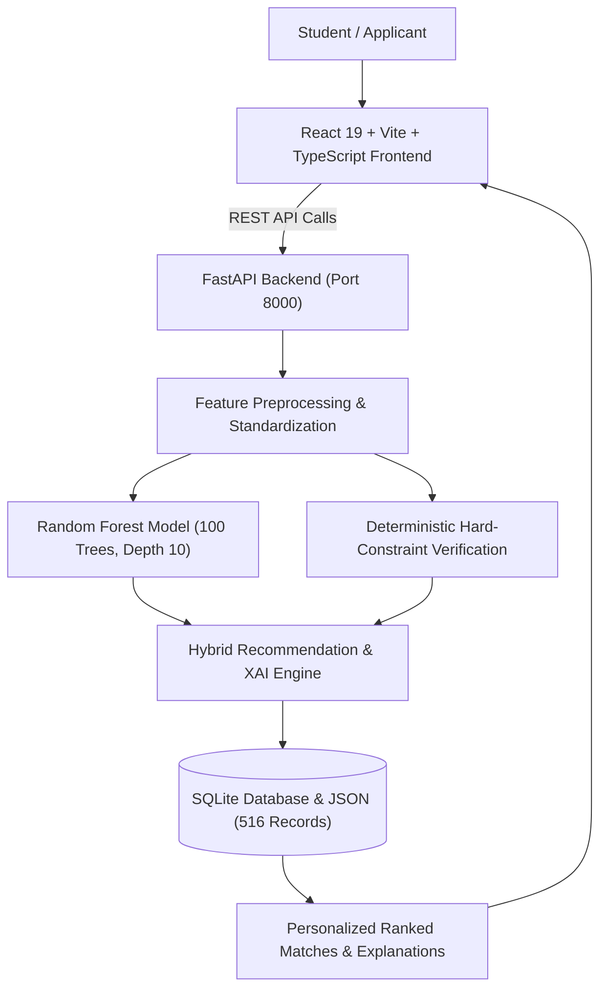

# ScholarMatch AI
### Smart Scholarship Eligibility & Recommendation System for Indian Students

> **"Find the Scholarships That Fit You."**  
> *"Your Profile. Your Eligibility. Your Opportunities."*

---

## 🌟 Executive Summary

**ScholarMatch AI** is a production-grade, AI-powered EdTech scholarship discovery and recommendation platform designed specifically for school, undergraduate, postgraduate, and diploma students across India.

It bridges the information and access gap by pairing each student's personal, academic, and financial background with **516+ verified Indian scholarships** spanning Central Government (NSP, AICTE, MoE, MoSJE), State Governments (all 28 states & UTs including MahaDBT, Karnataka SSP, WB SVMCM, UP Dashmottar), and top Corporate CSR initiatives (Reliance Foundation, Tata Trusts, Kotak Kanya, L'Oréal, HDFC Parivartan, Siemens, Infosys Foundation).

---

## 🏗️ System Architecture



1. **Frontend**: React 19, TypeScript, Vite, Tailwind CSS v4, Lucide Icons, Canvas-Confetti.
2. **REST API**: FastAPI with CORS, query filters, pagination, and admin data endpoints.
3. **Machine Learning**: Scikit-Learn `RandomForestClassifier(n_estimators=100, max_depth=10, random_state=42)` trained on standardized eligibility vectors.
4. **Recommendation Engine**: Combines ML probability confidence, hard legal/state constraints, income ratio margins, and Explainable AI factor ranking.
5. **Database**: SQLite `scholarships.db` populated with 516 verified Indian scholarship records.

---

## 🚀 Key Modules & Features

### 1. 🎓 Impressive Modern Landing Page
- Modern EdTech blue/indigo aesthetic with responsive layout.
- Hero headline: *"Find Scholarships That Match Your Future."*
- Interactive live recommendation preview mockup.
- 4-Step interactive roadmap: *Create Profile → Check Eligibility → Get Personalized Matches → Apply With Confidence*.
- Configured platform metrics (516+ Records, 100-Tree ML Classifier, Pan-India Coverage).
- Quick category chips: Engineering, Medical, Girls in STEM, Rural, EBC/BPL, SC/ST/OBC.

### 2. 📝 5-Step Guided Student Profile Wizard
- Step 1: Basic Details (Name, Age, Gender, Domicile State, District, Category).
- Step 2: Academic Details (Level, Course, Branch, Institution Type, Marks/CGPA, Previous Marks).
- Step 3: Financial Details (Annual Family Income in ₹, Income Certificate Status, Parent Employment).
- Step 4: Special Criteria (PwD Status, First-Generation Learner, Single Girl Child, Hostel/Day Scholar, Rural).
- Step 5: Profile Review & Confirmation with instant section edit capabilities.
- 1-Click Demo Pre-fills (Priya Sharma, Aarav Patel, Kavita Meena, Rahul Kumar).
- Tooltips explaining Indian educational terms (CGPA conversion to %, Tehsildar income certificate validity).

### 3. 🤖 AI Scholarship Eligibility Checker & Explainable AI
- Overall Compatibility Gauge (e.g. 98%).
- Metric counters: Eligible Scholarships, Potential Matches, Ineligible Schemes.
- **Explainable AI ("Why am I eligible?")**: Transparent factors showing why a scholarship matched (e.g., academic margin, income ceiling compliance, domicile validation, reservation eligibility).

### 4. 🔍 Comprehensive Search & Multi-Filter Directory
- Free-text search by scholarship name, course, state, provider.
- Sidebar filters: Education Level, Course, State, Category, Gender, Annual Income slider, Min Marks, Provider Type, Status, Renewal.
- Active count indicator (*"Showing 74 scholarships"*), Clear Filters, and Save Search.
- Smooth pagination (12 items per page).

### 5. ⚖️ Scholarship Comparison Matrix
- Compare 2 to 4 scholarships side-by-side.
- Compares: Amount, Income Limit, Minimum Marks, Category, State, Deadline, Renewal, Benefits, and Required Documents.

### 6. 🔖 Saved Scholarships & Bookmarks
- Add/remove bookmarks with one click.
- Stored persistently in local storage with deadline countdown indicators.

### 7. ⏰ Deadline Dashboard
- Categorized timeline: *Closing Soon (≤ 3 Days)*, *This Week (≤ 7 Days)*, *This Month*, and *Upcoming*.
- Color-coded urgency alerts (*"Closes Tomorrow"*, *"3 Days Left"*).

### 8. 📊 Personalized Student Dashboard
- Greeting: *"Welcome back, Priya Sharma 👋"*.
- Profile Completion meter (95%), Eligible count, Saved count, Urgent deadlines.
- *"Recommended For You"* personalized cards.
- *"Improve Your Match"* actionable guidance.

### 9. 📋 Interactive Document Checklist
- Status toggles for each document (*Available / Applied / Missing*).
- Real-time application document readiness meter (e.g. 88%).
- Explanations of issuing authorities (Tehsildar, UIDAI, University Registrar).

### 10. 🛡️ Admin Dashboard & Data Management
- Protected login portal (Username: `admin`, Password: `scholarmatch2026`).
- Statistics: Total Records, Active Schemes, Deadlines, Central Govt vs State Govt vs CSR.
- Scholarship CRUD: Add scholarship, Edit existing record, Delete record.
- CSV Upload & Data Validation before database insertion.

### 11. ⚖️ Trust, Transparency & Official Links
- Prominent *"Apply on Official Website"* direct CTAs pointing to verified portals (`scholarships.gov.in`, state portals).
- Mandatory *"Verify Before Applying"* advisory callouts.
- Full FAQ addressing 8 common student inquiries.

---

## 💻 Tech Stack

| Layer | Technologies |
| :--- | :--- |
| **Frontend** | React 19, TypeScript, Vite, Tailwind CSS v4, Lucide Icons, Canvas-Confetti |
| **Backend** | Python 3.14, FastAPI, Uvicorn, Pydantic, Python-Multipart |
| **Machine Learning** | Scikit-Learn (`RandomForestClassifier`), NumPy, Pandas, Joblib |
| **Database** | SQLite3 (`scholarships.db`), JSON dataset backup (`scholarships.json`) |

---

## 🏃 Quick Start & Deployment Guide

### Option 1: One-Click Production Mode (Single Port 8000)
To build the optimized frontend and run both UI + Backend unified on `http://127.0.0.1:8000`:
- **Windows**: Run `deploy.bat`
- **Linux / macOS**: Run `./deploy.sh`

---

### Option 2: Docker & Docker Compose
```bash
docker compose up --build -d
```
Visit **`http://localhost:8000`** in your browser.

---

### Option 3: Cloud Deployment (Render / Railway / Fly.io)
- **Render**: Connect repository. Render automatically reads `render.yaml` and `Dockerfile`.
- **Railway / Heroku**: Connect repository. Automatically detects `Dockerfile` or `Procfile`.
- **Vercel** (Frontend only): Deploy `frontend/` folder with `vercel.json`.

---

### Option 4: Local Development Mode (Hot-Reload)
1. **Backend**:
   ```bash
   cd backend
   pip install -r requirements.txt
   python -m uvicorn main:app --host 127.0.0.1 --port 8000
   ```
2. **Frontend**:
   ```bash
   cd frontend
   npm install
   npm run dev
   ```
   Open **`http://localhost:5173`**.

---

## 🔐 Admin Portal Credentials

- **URL**: Click *"Admin"* in top navigation or visit the Admin tab
- **Username**: `admin`
- **Password**: `scholarmatch2026` *(or `admin123`)*
